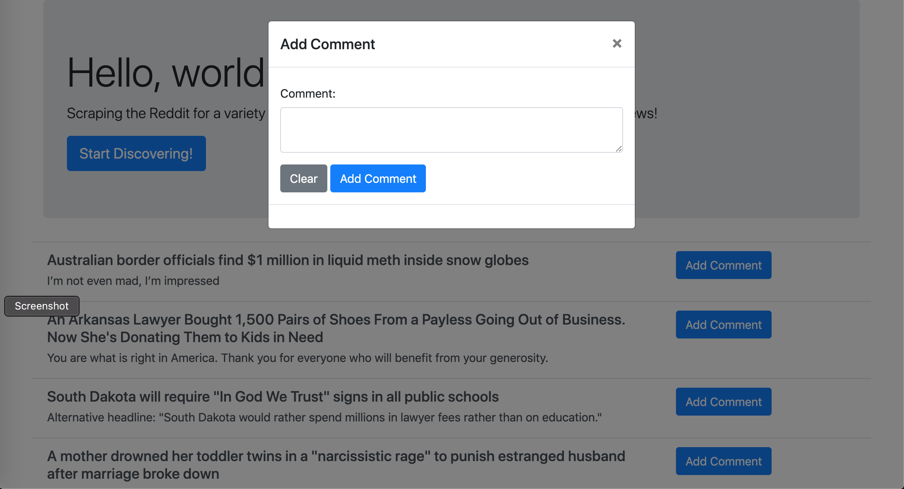
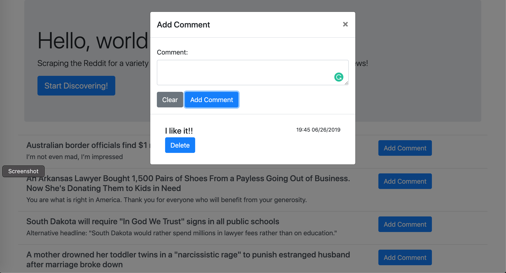

# scrapy_forum

## Reddit News Scrapper

"The Reddit News Scrapper" can scrape news from reddit, add comments to each article or delete comments. You don't need to waste your time searching for news in different sites because Reddit has it all! To check out our demo [website](https://pure-brook-80430.herokuapp.com/#)

## Functionality

### Scrapping Reddit for more updated news

You can press "Start Discovering" to load more recent news

### Add comments to the new articles and interact with the community

Click "Add comment" to see other comments and add comments

### Delete comments

You can also click delete to delete the comments

